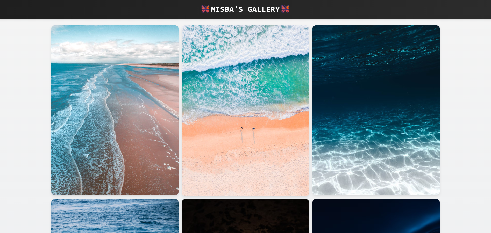
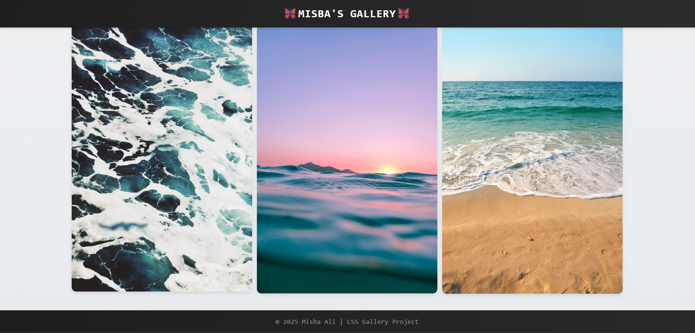

# GalleryGrid

A clean and responsive photo gallery webpage built with HTML and CSS. It features a visually appealing layout, hover effects, and high-quality images sourced from Unsplash — perfect for showcasing photography or styling UI.

---

## Features

- Responsive photo gallery layout
- Clean and modern design
- Use of Google Fonts for custom typography
- High-quality images from Unsplash
- Hover effect for images
- Footer with gradient background and muted text styling

---

## Screenshots

### GalleryGrid Preview

  
### Top Section

  
### Bottom Section


---

## Getting Started

To run this project locally, follow these steps:
1. **Clone the repository:**
    ```bash
    git clone https://github.com/Misba0019/GalleryGrid.git
    ```
2. **Open `index.html` in your web browser.**

---

## Credits

- **Images**: Sourced from [Unsplash](https://unsplash.com) – used for demonstration only
- **Fonts**: [Google Fonts](https://fonts.google.com)

---

## License

This project is licensed under the [MIT LICENSE](LICENSE).